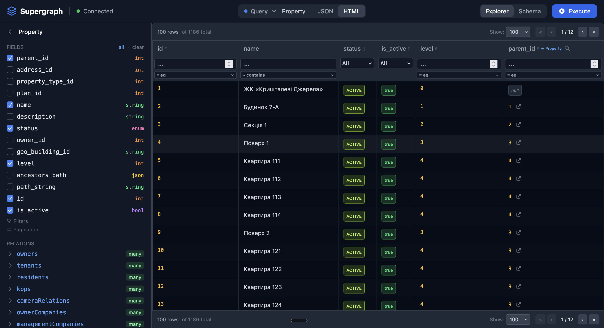
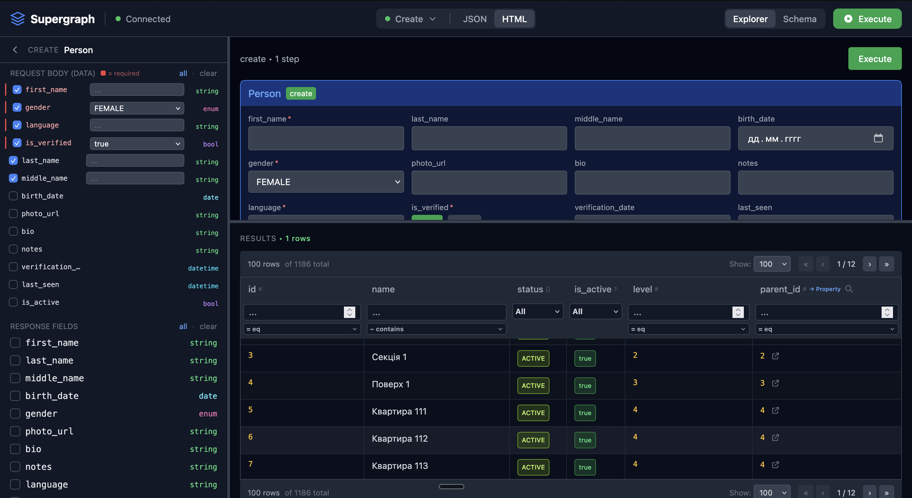
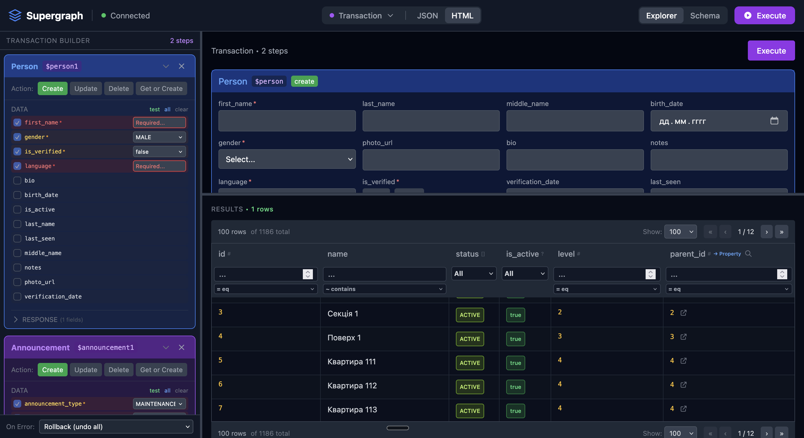
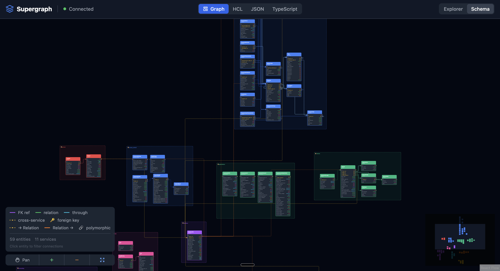
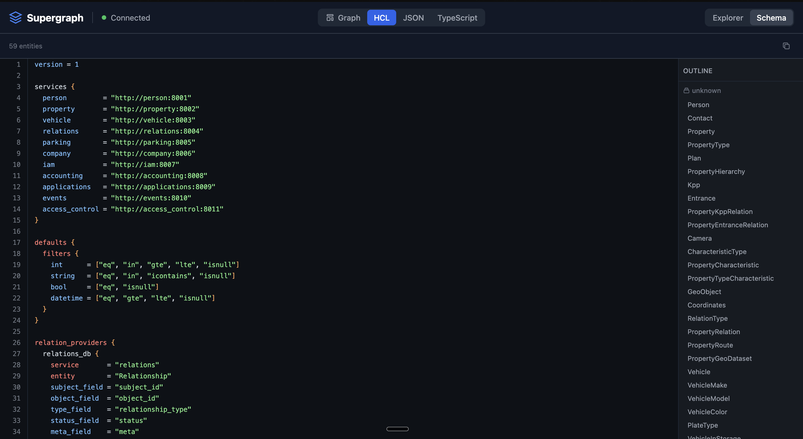
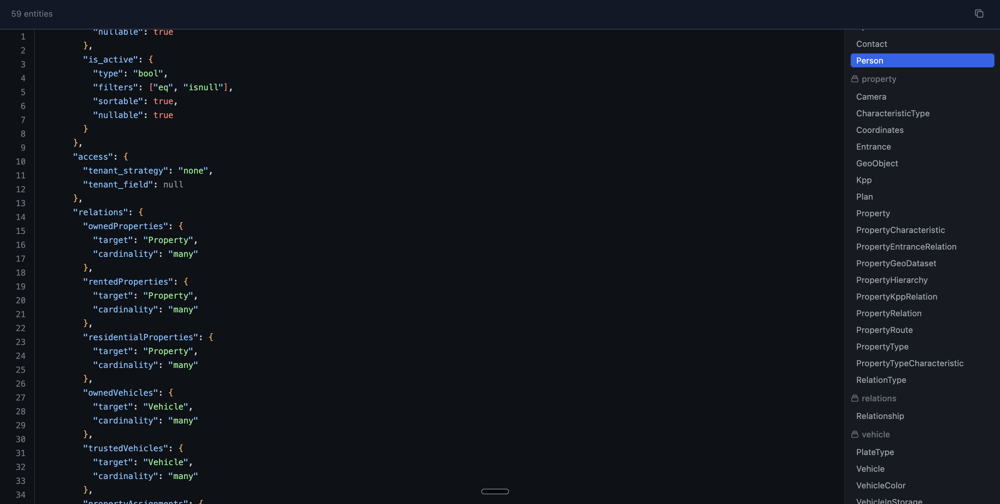
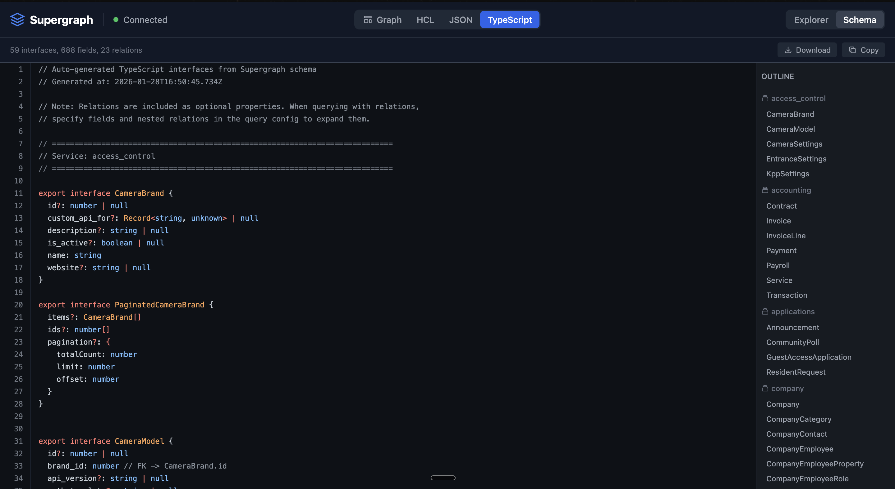

# Supergraph

**JSON Query DSL for Microservices** — Powerful alternative to GraphQL Federation.

## Why Supergraph?

In microservice architecture, data is spread across multiple services. Traditional approaches have problems:

- **REST**: Multiple round-trips, N+1 queries, manual data stitching
- **GraphQL Federation**: Complex schema stitching, code generation, schema conflicts

**Supergraph solves this** with a simple JSON-based query language that:

1. **Single request** — Query any data across services in one call
2. **No code generation** — Just declare ViewSets, types are auto-discovered
3. **Relations via separate service** — Extend entities without touching their services
4. **Automatic federation** — Gateway discovers schemas from services at runtime

## Core Concepts

### 1. ViewSets — Declare, Don't Code

Each entity is a ViewSet that declares what to expose. Fields, types, and filters are auto-discovered from SQLAlchemy models:

```python
from supergraph import ModelViewSet

class PersonViewSet(ModelViewSet):
    model = Person  # SQLAlchemy model
    # That's it! Fields, types, filters auto-discovered
```

### 2. Relations Service — Extend Without Modify

The key innovation: a dedicated **relations service** that extends other entities without modifying them.

```python
from supergraph import RelationsViewSet, AttachRelation

class RelationshipViewSet(RelationsViewSet):
    model = Relationship
    service = "relations"

    attach = [
        # Add "ownedProperties" field to Person entity
        AttachRelation(
            parent_entity="Person",
            field_name="ownedProperties",
            target_entity="Property",
            relationship_type="property_owner",
        ),
        # Add reverse: "owners" field to Property
        AttachRelation(
            parent_entity="Property",
            field_name="owners",
            target_entity="Person",
            relationship_type="property_owner",
        ),
    ]
```

Now `Person` has `ownedProperties` field and `Property` has `owners` — without changing Person or Property services.

### 3. Gateway — Automatic Federation

Gateway discovers schemas from all services at startup and compiles them into a unified graph:

```
┌─────────────────────────────────────────────────────────────────┐
│                          Gateway                                 │
│  ┌─────────────────────────────────────────────────────────────┐│
│  │  Request → Validate → Plan → Execute → Assemble → Response  ││
│  └─────────────────────────────────────────────────────────────┘│
└─────────────────────────────────────────────────────────────────┘
         │                    │                    │
         ▼                    ▼                    ▼
   ┌──────────┐        ┌──────────┐        ┌──────────┐
   │  Person  │        │ Property │        │Relations │
   │ Service  │        │ Service  │        │ Service  │
   └──────────┘        └──────────┘        └──────────┘
```

---

## JSON Query Language (JsonQL)

### Basic Query

Fetch entities with selected fields:

```json
{
  "Person": {
    "fields": ["id", "first_name", "last_name", "email"]
  }
}
```

Response:
```json
{
  "data": {
    "items": [
      {"id": 1, "first_name": "John", "last_name": "Doe", "email": "john@example.com"},
      {"id": 2, "first_name": "Jane", "last_name": "Smith", "email": "jane@example.com"}
    ],
    "pagination": {"total": 2, "limit": 50, "offset": 0, "has_next": false}
  }
}
```

### Filtering

Use `field__operator` syntax:

```json
{
  "Person": {
    "filters": {
      "first_name__icontains": "john",
      "is_active__eq": true,
      "age__gte": 18,
      "id__in": [1, 2, 3]
    },
    "fields": ["id", "first_name"]
  }
}
```

**Available operators:**

| Operator | Description | Example |
|----------|-------------|---------|
| `eq` | Equals | `{"id__eq": 1}` |
| `in` | In list | `{"id__in": [1, 2, 3]}` |
| `icontains` | Case-insensitive contains | `{"name__icontains": "john"}` |
| `gte` | Greater than or equal | `{"age__gte": 18}` |
| `lte` | Less than or equal | `{"price__lte": 100}` |
| `isnull` | Is null check | `{"deleted_at__isnull": true}` |

### Pagination

Control result size with `limit` and `offset`:

```json
{
  "Person": {
    "fields": ["id", "first_name"],
    "limit": 10,
    "offset": 20
  }
}
```

Response includes pagination metadata:
```json
{
  "data": {
    "items": [...],
    "pagination": {
      "total": 150,
      "limit": 10,
      "offset": 20,
      "has_next": true
    }
  }
}
```

### Ordering

Sort results with `order` array. Prefix with `-` for descending:

```json
{
  "Person": {
    "fields": ["id", "first_name", "created_at"],
    "order": ["-created_at", "first_name"]
  }
}
```

### Nested Relations

Fetch related data in a single request — this is where Supergraph shines:

```json
{
  "Person": {
    "filters": {"id__eq": 1},
    "fields": ["id", "first_name", "last_name"],
    "relations": {
      "ownedProperties": {
        "fields": ["id", "address", "status"],
        "filters": {"status__eq": "active"},
        "limit": 5,
        "relations": {
          "tenants": {
            "fields": ["id", "first_name", "email"]
          }
        }
      },
      "ownedVehicles": {
        "fields": ["id", "plate", "make"],
        "order": ["-created_at"]
      }
    }
  }
}
```

Response has nested data:
```json
{
  "data": {
    "id": 1,
    "first_name": "John",
    "last_name": "Doe",
    "ownedProperties": [
      {
        "id": 10,
        "address": "123 Main St",
        "status": "active",
        "tenants": [
          {"id": 5, "first_name": "Alice", "email": "alice@example.com"}
        ]
      }
    ],
    "ownedVehicles": [
      {"id": 20, "plate": "ABC-123", "make": "Toyota"}
    ]
  }
}
```

**Key point**: `ownedProperties` comes from Relations service, `tenants` also from Relations service. Person and Property services know nothing about each other — Relations service defines these connections.

### Multi-Entity Query

Query multiple entities in one request:

```json
{
  "query": {
    "Person": {
      "filters": {"id__in": [1, 2, 3]},
      "fields": ["id", "first_name"]
    },
    "Property": {
      "filters": {"status__eq": "active"},
      "fields": ["id", "address"]
    }
  }
}
```

---

## Mutations

### Create

```json
{
  "create": {
    "Person": {
      "data": {
        "first_name": "John",
        "last_name": "Doe",
        "email": "john@example.com"
      },
      "response": ["id", "first_name", "created_at"]
    }
  }
}
```

### Update (Partial)

```json
{
  "update": {
    "Person": {
      "id": 1,
      "data": {
        "email": "newemail@example.com"
      }
    }
  }
}
```

### Rewrite (Full Replace)

```json
{
  "rewrite": {
    "Person": {
      "id": 1,
      "data": {
        "first_name": "John",
        "last_name": "Smith",
        "email": "john.smith@example.com"
      }
    }
  }
}
```

### Delete

```json
{
  "delete": {
    "Person": {
      "id": 1
    }
  }
}
```

### HTTP Method Aliases

For REST familiarity:

| HTTP Alias | Operation |
|------------|-----------|
| `POST` | `create` |
| `PATCH` | `update` |
| `PUT` | `rewrite` |
| `DELETE` | `delete` |

```json
{
  "POST": {
    "Person": {
      "data": {"first_name": "John"}
    }
  }
}
```

---

## Transactions

Execute multiple operations atomically with variable binding between steps.

### Why Transactions?

Consider creating a Person with their Property and the ownership relation. Without transactions:

1. Create Person → get `person_id`
2. Create Property → get `property_id`
3. Create Relationship with both IDs

If step 3 fails, you have orphan records. With transactions:

```json
{
  "transaction": {
    "steps": [
      {
        "create": {"Person": {"data": {"first_name": "John"}}},
        "as": "$person"
      },
      {
        "create": {"Property": {"data": {"address": "123 Main St"}}},
        "as": "$property"
      },
      {
        "create": {
          "Relationship": {
            "data": {
              "subject_type": "property",
              "subject_id": "$property.id",
              "object_type": "person",
              "object_id": "$person.id",
              "relationship_type": "property_owner"
            }
          }
        }
      }
    ],
    "on_error": "rollback"
  }
}
```

**Variable binding**: `$person.id` references the ID from step 1. The transaction executor resolves these before each step.

### Error Handling

| Mode | Behavior |
|------|----------|
| `rollback` | Undo all changes on any error (default) |
| `stop` | Stop at error, keep completed steps |
| `continue` | Skip errors, complete all possible steps |

### Nested Mutations (Shorthand)

For common patterns, use nested syntax — it compiles to a transaction automatically:

```json
{
  "create": {
    "Person": {
      "data": {"first_name": "John"},
      "nested": {
        "ownedProperties": [
          {"data": {"address": "123 Main St"}},
          {"data": {"address": "456 Oak Ave"}}
        ]
      }
    }
  }
}
```

This creates Person, two Properties, and two Relationships in one atomic operation.

### Get-or-Create

Find existing or create new:

```json
{
  "get_or_create": {
    "Person": {
      "lookup": {"email__eq": "john@example.com"},
      "defaults": {"first_name": "John", "last_name": "Doe"},
      "response": ["id", "first_name", "email"]
    }
  }
}
```

---

## Installation & Setup

### Install

```bash
pip install supergraph
```

### Initialize Project

```bash
supergraph init my-project
cd my-project
```

Creates:
```
my-project/
├── supergraph.yaml     # Configuration
├── services/           # Microservices
├── gateway/            # API gateway
└── docker-compose.yml
```

### Create Services

```bash
supergraph create-service person --port 8001
supergraph create-service property --port 8002
supergraph create-service relations --port 8003
```

Each service has Django-like structure:
```
services/person/
├── main.py              # FastAPI entry
├── manage.py            # CLI commands
├── models/models.py     # SQLAlchemy models
├── views/viewsets.py    # Supergraph ViewSets
└── settings/config.py   # Configuration
```

### Run

```bash
supergraph dev
# or
docker-compose up
```

---

## ViewSet Reference

### ModelViewSet — Basic Entity

```python
from supergraph import ModelViewSet, AccessConfig

class PersonViewSet(ModelViewSet):
    model = Person

    # Optional: override auto-inferred values
    service = "person"           # default: model name lowercase
    resource = "/person"         # default: /model_name

    # Field control
    fields_exclude = ["password", "internal_note"]
    filter_overrides = {
        "email": ["eq", "icontains"],  # custom operators for this field
    }
    sortable_fields = {"id", "first_name", "created_at"}

    # Pagination
    pagination_default_limit = 50
    pagination_max_limit = 200

    # Access control (tenant isolation)
    access = AccessConfig.direct(tenant_field="rc_id")
```

### Field Auto-Discovery

Types and filters are inferred from SQLAlchemy columns:

| SQLAlchemy Type | Supergraph Type | Default Filters |
|-----------------|-----------------|-----------------|
| `Integer` | `int` | `eq`, `in`, `gte`, `lte`, `isnull` |
| `String`, `Text` | `string` | `eq`, `in`, `icontains`, `isnull` |
| `Boolean` | `bool` | `eq`, `isnull` |
| `Float`, `Numeric` | `float` | `eq`, `in`, `gte`, `lte`, `isnull` |
| `DateTime` | `datetime` | `eq`, `gte`, `lte`, `isnull` |
| `Enum` | `enum` | `eq`, `in`, `isnull` |
| `JSON` | `json` | `eq`, `isnull` |

### RelationsViewSet — Cross-Service Relations

```python
from supergraph import RelationsViewSet, AttachRelation

class RelationshipViewSet(RelationsViewSet):
    model = Relationship
    service = "relations"

    attach = [
        # Person.ownedProperties -> [Property]
        AttachRelation(
            parent_entity="Person",
            field_name="ownedProperties",
            target_entity="Property",
            relationship_type="property_owner",
        ),
        # Property.owners -> [Person]
        AttachRelation(
            parent_entity="Property",
            field_name="owners",
            target_entity="Person",
            relationship_type="property_owner",
        ),
        # Property.tenants -> [Person]
        AttachRelation(
            parent_entity="Property",
            field_name="tenants",
            target_entity="Person",
            relationship_type="property_tenant",
        ),
    ]
```

**AttachRelation defaults:**
- `parent_id_field = "id"` — primary key of parent
- `target_id_field = "id"` — primary key of target
- `filters = {"status": "active"}` — only active relations
- `cardinality = "many"` — returns array

---

## Gateway

### Setup

```python
from supergraph import Gateway

gateway = Gateway(
    services={
        "person": "http://person:8001",
        "property": "http://property:8002",
        "relations": "http://relations:8003",
    },
    title="My API",
    playground=True,
)

app = gateway.app
```

### Endpoints

| Endpoint | Method | Description |
|----------|--------|-------------|
| `/` | POST | Unified query/mutation |
| `/query` | POST | Execute queries |
| `/__graph` | GET | Compiled schema (JSON) |
| `/__graph.ts` | GET | TypeScript types |
| `/playground` | GET | Visual query builder |
| `/health` | GET | Health check |

### REST-style Endpoints

```
GET    /entity/Person                    # List
GET    /entity/Person?filters={...}      # Filter
POST   /entity/Person                    # Create
PATCH  /entity/Person                    # Update
PUT    /entity/Person                    # Replace
DELETE /entity/Person                    # Delete
```

---

## Playground

Interactive visual interface for building queries and exploring the schema.

Access at: `http://localhost:8000/playground`

### Explorer

**Query Mode (JSON Response)** — Build queries visually: select entity, pick fields, add filters, configure relations. See raw JSON response with syntax highlighting.


**Query Mode (Table View)** — Same query, but results displayed in sortable, filterable table with server-side pagination. Click column headers to sort, use pagination controls at bottom.



**Create Mode** — Visual form for creating records. Form fields are auto-generated from schema with proper input types. FK fields have lookup buttons to search and select related entities.



**Transaction Mode** — Build multi-step transactions visually. Add steps for create/update/delete operations, configure variable bindings between steps (`$person.id`), set error handling mode (rollback/stop/continue). See generated JSON and execute.



### Schema Views

**Graph View** — Interactive ERD diagram showing all entities and their relations across services. Entities are color-coded by service. Click to see details, drag to rearrange, zoom to explore.



**HCL View** — Human-readable schema in HCL format with outline navigation on the left. Click any entity to jump to its definition. Shows fields with types, available filters, relations to other entities.



**JSON View** — Full compiled schema in JSON format. Useful for debugging and understanding the exact structure gateway uses internally. Outline navigation on the left.



**TypeScript View** — Auto-generated TypeScript interfaces for all entities. Download button to save as file, Copy button for clipboard. Includes entity interfaces, filter types, relation configs, create/update inputs, and typed React hooks.



---

## TypeScript Integration

### Generate Types

Download types from running backend:

```bash
curl http://localhost:8000/__graph.ts > src/generated/supergraph.ts

# Or use CLI
npx use-supergraph generate --url http://localhost:8000/__graph.ts --output ./src/generated
```

### React Hooks

```bash
npm install @supergraph/use-supergraph @tanstack/react-query
```

```typescript
import { PersonHooks } from './generated/supergraph'

function PersonList() {
  const { data, isLoading } = PersonHooks.useMany({
    fields: ['id', 'first_name', 'last_name'],  // Autocomplete!
    filters: { is_active__eq: true },
    relations: {
      ownedProperties: {
        fields: ['id', 'address']
      }
    },
    limit: 10
  })

  if (isLoading) return <div>Loading...</div>

  return (
    <ul>
      {data?.items.map(person => (
        <li key={person.id}>
          {person.first_name} - {person.ownedProperties?.length} properties
        </li>
      ))}
    </ul>
  )
}
```

---

## CLI Commands

### Project

```bash
supergraph init [name]           # Initialize project
supergraph create-service <name> # Create service
supergraph sync                  # Sync config → docker-compose
supergraph dev                   # Run development
```

### Service (manage.py)

```bash
python manage.py makemigrations  # Create migration
python manage.py migrate         # Apply migrations
python manage.py recreatedb      # Full database reset
python manage.py initial_data    # Load seed data
```

---

## License

MIT
